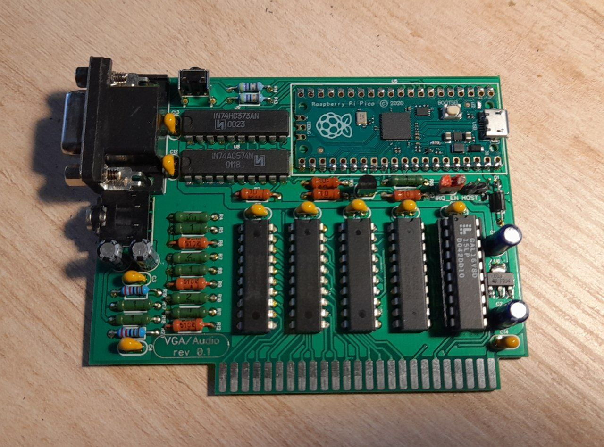

# a2vga_audio
 Apple II vga + Mockingboard emulation board at the same time as the vga output.
 This project based on [Mark Aikens Apple II VGA](https://github.com/markadev/AppleII-VGA/) and [A2Analog](https://github.com/V2RetroComputing/analog)

 

